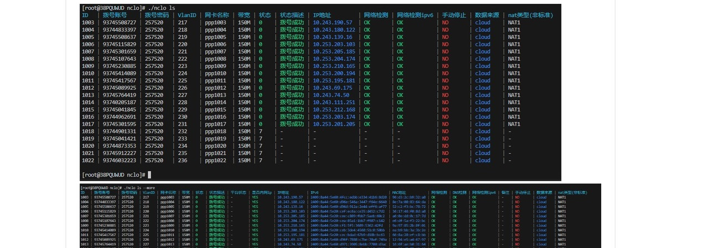

# OutFormat

A powerful Go library for flexible output formatting in command-line applications. OutFormat provides multiple output formats with intelligent data parsing, syntax highlighting, and table generation capabilities.

## Features

- **Multiple Output Formats**: JSON, YAML, TOML, CSV, and formatted tables
- **Intelligent Data Parsing**: Automatically detects and formats structured data
- **Syntax Highlighting**: Color-coded output with customizable highlighting rules
- **Table Generation**: Beautiful table output with row/column orientation options
- **Error Handling**: Graceful fallback to JSON when format conversion fails
- **Machine-Readable Output**: Support for machine parsing with structured formats

ex.

## Installation

```bash
go get github.com/binrclab/outformat
```

## Quick Start

```go
package main

import (
    "github.com/binrclab/outformat"
)

func main() {
    data := map[string]interface{}{
        "id":   1,
        "name": "example",
        "status": "active",
    }
    
    // Output as formatted JSON
    outformat.SuccessOutput(data, "", "json")
    
    // Output as table
    outformat.SuccessOutput(data, "", "table")
    
    // Output as YAML
    outformat.SuccessOutput(data, "", "yaml")
}
```

## Supported Output Formats

### 1. JSON Formats
- `json`: Pretty-printed JSON with indentation
- `json-line`: Compact JSON on single line

### 2. Data Serialization
- `yaml`: YAML format output
- `toml`: TOML format output
- `csv`: CSV format (for tabular data)

### 3. Table Formats
- `table`: Default table format
- `table.row`: Row-oriented table layout
- `table.col`: Column-oriented table layout

## Core Functions

### SuccessOutput
Main function for outputting successful results:

```go
func SuccessOutput(result interface{}, override string, outputFormat string, failflag ...string)
```

**Parameters:**
- `result`: Data to output (any type)
- `override`: Override message (optional)
- `outputFormat`: Desired output format
- `failflag`: Error flag for error styling

### SuccessOutputl
Output success message with standard structure:

```go
func SuccessOutputl(message string, override string, outputFormat string)
```

### ErrorOutputl
Output error message with standard structure:

```go
func ErrorOutputl(errResult error, override string, outputFormat string)
```

## Usage Examples

### Basic Data Output

```go
// Simple map output
data := map[string]string{
    "status": "success",
    "message": "Operation completed",
}

outformat.SuccessOutput(data, "", "json")
```

### Table Output

```go
// Array of objects for table output
users := []map[string]interface{}{
    {"id": 1, "name": "Alice", "role": "admin"},
    {"id": 2, "name": "Bob", "role": "user"},
    {"id": 3, "name": "Charlie", "role": "user"},
}

outformat.SuccessOutput(users, "", "table")
```

### Error Handling

```go
if err != nil {
    outformat.ErrorOutputl(err, "", "json")
    return
}
```

### Conditional Format Selection

```go
// Check if machine-readable output is requested
if outformat.HasMachineOutputFlag() {
    outformat.SuccessOutput(data, "", "json")
} else {
    outformat.SuccessOutput(data, "", "table")
}
```

## Syntax Highlighting

The library automatically applies color coding to common patterns:

- **Timestamps**: Light blue (`2006-01-02 15:04:05`)
- **IP Addresses**: Light blue (IPv4 and IPv6)
- **MAC Addresses**: Light blue
- **Status Keywords**: 
  - Success: Green (`OK`, `succeeded`, `成功`)
  - Warning: Light yellow (`WAR`, `DBG`)
  - Error: Light red (`ERR`, `failed`, `失败`, `错误`)
- **Network Terms**: Light blue (`cloud`, `local`)

## Data Structure Support

The library automatically detects and handles:

- **Objects**: Key-value pairs displayed as tables
- **Arrays**: Multiple objects displayed as rows
- **Nested Structures**: Recursively processed for table generation
- **Mixed Types**: Automatic conversion to string representation

## Table Generation

### Automatic Table Creation
When using table formats, the library:

1. Extracts keys from the first object as column headers
2. Sorts columns with priority (ID first, message last)
3. Generates rows from data values
4. Applies appropriate styling and colors

### Table Orientation
- **Row-oriented**: Each object becomes a row
- **Column-oriented**: Each object becomes a column (useful for comparing few items)

## Error Handling and Fallbacks

The library implements robust error handling:

- **Format Conversion Failures**: Falls back to JSON output
- **Invalid Data**: Gracefully handles malformed input
- **Exit Codes**: Proper exit codes for success (0) and errors (2)
- **Logging**: Comprehensive logging for debugging

## Dependencies

- `github.com/TylerBrock/colorjson`: JSON colorization
- `github.com/bitly/go-simplejson`: JSON manipulation
- `github.com/fatih/color`: Terminal colors
- `github.com/pelletier/go-toml/v2`: TOML support
- `github.com/pterm/pterm`: Table rendering
- `github.com/rs/zerolog/log`: Logging
- `gopkg.in/yaml.v3`: YAML support

## Contributing

Contributions are welcome! Please feel free to submit pull requests or open issues for bugs and feature requests.

## License

This project is licensed under the MIT License - see the LICENSE file for details. 